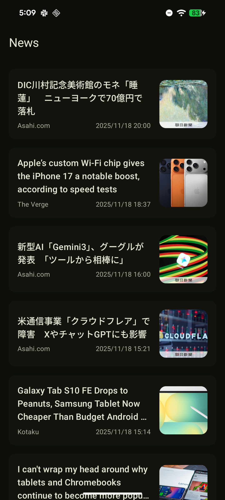
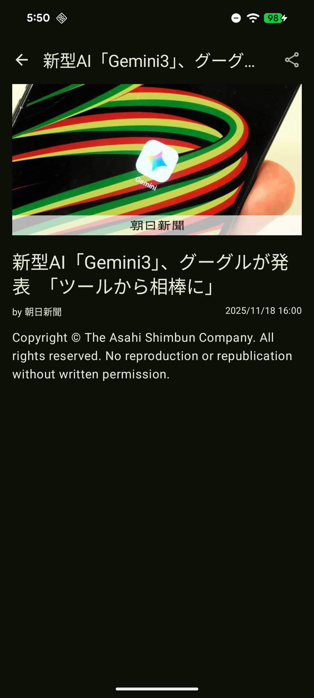
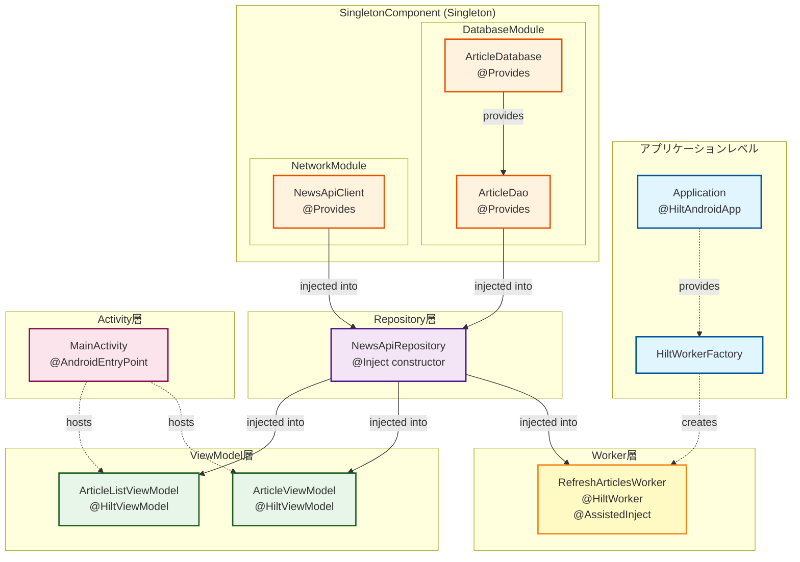
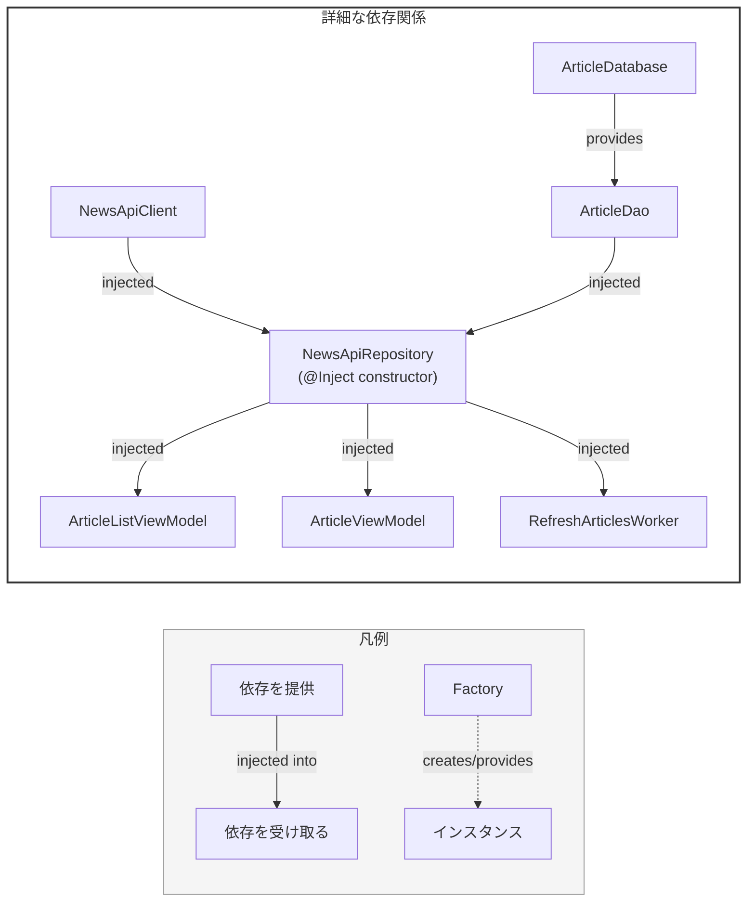

# ニュースアプリ

> [!IMPORTANT]
> このREADMEはAI生成によるものです。  
> このアプリは WorkManager を利用してみたくて作成したサンプルです。そのため、ニュースアプリとしての機能は必要最小限の実装に留めています。 

KotlinとモダンなAndroid開発技術で構築された、シンプルなニュース閲覧アプリケーションです。  

## ✨ 主な機能

- 📰 最新ニュース記事の一覧表示
- 📄 シンプルで読みやすい記事詳細画面
- 🔗 他のアプリへの記事共有機能
- 💾 オフライン時のための記事キャッシュ機能

※ニュースに関しては、News APIで取得できるコンテンツをもとに表示しているため、本文が表示されない場合があります。

## 🛠️ 技術スタックとアーキテクチャ

このプロジェクトはMVVM (Model-View-ViewModel) アーキテクチャパターンを採用し、以下のモダンなライブラリと技術を使用しています。

- **UI層**: **Jetpack Compose** を全面的に採用し、UIコンポーネントには **Material 3** を使用しています。
- **アーキテクチャ**: **MVVM**
  - **ViewModel**: `androidx.lifecycle.ViewModel` を使用し、UI関連のデータをライフサイクルを意識して管理します。
  - **画面遷移**: **Navigation Compose** を用いて、コンポーザブル間の画面遷移を制御します。
- **DI (Dependency Injection)**: **Hilt** を使用して、アプリ全体の依存関係を管理します。
- **データ層**:
  - **通信**: **Retrofit** を使用してニュースAPIへアクセスし、JSONのパースには **Kotlinx Serialization** を利用しています。
  - **データベース**: **Room** を使用して、ニュース記事をローカルにキャッシュします。
  - **非同期処理**: **Kotlin Coroutines** を用いて、バックグラウンド処理を管理します。
  - **バックグラウンド処理**: **WorkManager** を使用して、定期的なデータのバックグラウンド同期を行います。
- **画像読み込み**: **Coil** を使用して、画像の読み込みと表示を効率的に行います。

## ⚙️ セットアップ方法

このプロジェクトをビルドして実行するには、[NewsAPI.org](https://newsapi.org/) のAPIキーが必要です。

1. リポジトリをクローンします:
   ```bash
   git clone https://github.com/hir05o1/android-news-app.git
   ```

2. プロジェクトのルートディレクトリに `local.properties` ファイルを作成します。

3. `local.properties` ファイルにあなたのNewsAPIキーを追加します:
   ```properties
   NEWS_API_API_KEY="ここにあなたのAPIキーを記述"
   ```

4. Gradleプロジェクトを同期し、アプリを実行します。

## 📸 スクリーンショット

|                   一覧画面                    |                 詳細画面                 |
|:-----------------------------------------:|:------------------------------------:|
|  |  |


## 依存関係グラフ


